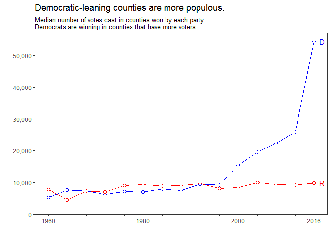

County-Level US Presidential Elections, 1960-2016
================

-   [Introduction](#introduction)
-   [Caveats and Missing Data](#caveats-and-missing-data)
-   [Examples](#examples)
    -   [Relative ordering of counties according to Dem/Rep votes](#relative-ordering-of-counties-according-to-demrep-votes)
    -   [Polarization at county level](#polarization-at-county-level)
    -   [Population of Dem./Rep. leaning counties](#population-of-dem.rep.-leaning-counties)
    -   [Number of counties won by each party](#number-of-counties-won-by-each-party)

Introduction
============

This repository contains county-level presidential election results in the US for the elections held between 1960 and 2016 (15 elections). The data is taken from [Dave Leip's Atlas of U.S. Presidential Elections](http://uselectionatlas.org/).

The main file you want to use is [data/processed/us-presidential-counties-1960-2016.tsv](data/processed/us-presidential-counties-1960-2016.tsv). It's a tab-separated file that contains one line per county, election year, party triplet. The column names are descriptive enough. If you need the details have a look at the [codebook](codebook.txt).

The code that scrapes the raw data and produces the above tsv file is included to help other researchers verify and replicate the data collection and generation process. If you find any issues and bugs either let us know or send pull requests. Also included is an example RMarkdown file which produces this README and demonstrates some very preliminary analysis we have done on the data.

Caveats and Missing Data
========================

County-level data for Maine and Massachusetts in 2016 comes from [tonmcg's GitHub repository](https://github.com/tonmcg/County_Level_Election_Results_12-16).

Some of the election results in Alaska were given in districts. Since we are unable to map the districts and other boroughs in Alaska reliable we decided to remove all data points from Alaska. They are still present in the raw files, but not in the final tsv.

Similarly, the counties and independent towns county status in the Commonwealth of Virginia have changes a lot in the last 50 years. Therefore it is not feasible to link different counties over elections and geographical units with the same names may refer to very different areas and populations. We decdided to remove Virginia from the dataset the same way we did for Alaska.

Examples
========

Relative ordering of counties according to Dem/Rep votes
--------------------------------------------------------

Let's order all the counties according to the percent of vote the Democratic party got in 2016. The top 5 (actually 6 including a tie) are:

| State                | County               |  Dem. Vote (%)|
|:---------------------|:---------------------|--------------:|
| District of Columbia | District of Columbia |           90.9|
| New York             | Bronx                |           88.4|
| Maryland             | Prince George's      |           88.1|
| Mississippi          | Claiborne            |           86.8|
| Mississippi          | Jefferson            |           86.5|
| South Dakota         | Oglala Lakota        |           86.5|

which contains all of the top-5 countiesof the 2012 elections:

| State                | County               |  Dem. Vote (%)|
|:---------------------|:---------------------|--------------:|
| South Dakota         | Oglala Lakota        |           93.4|
| New York             | Bronx                |           91.4|
| District of Columbia | District of Columbia |           90.9|
| Maryland             | Prince George's      |           89.7|
| Mississippi          | Jefferson            |           89.1|

This observation is not limited to the top. In fact, the rank correlation of counties according to their Democratic votes between 2012 and 2016 is 0.94 (where 1.0 would indicate a perfect matching of ordering). Rank correlation obtained by Republican vote ordering is 0.93 (the values are not identical because of independent/third-party votes).

A correlation of 0.94 is very high, indicating that even if the actual votes may go up and down, the relative ordering of the counties is almost fixed from 2012 to 2016. How about historical changes? In the graph below, we plot the average correlation between each consecutive election (the average of correlation obtained for Democratic ordering and Republican ordering). After a striking jump in the late 70's, the correlation steadily increased from 0.8 to its current value 0.94.

Polarization at county level
----------------------------

To keep things simple, for every election we simply computed the median vote (in %) the winning party got in each county. For example, for 2016 we look at all the counties where the Republican party was leading and computed the mid-point of the party's vote share. The value was 69.5%. In other words, in half of the counties where Republican won the county-race, its vote share was higher than 69.5%! Historically speaking, there have been ups and dows before the 90s, but since the 1992 elections, the counties have become more polarized in the sense that the winning party gets more and more of the vote share.

Population of Dem./Rep. leaning counties
----------------------------------------

Let's look at the median number of voters who cast a vote in each county, grouped by the party which won in that county. Until 1996, a typical (median) Democratic county and Republican county were similar in number of total votes case, around 10,000. This number stayed almost constant for the Republican party. However, in 2016, we see that the kind of counties where Democratic party got the plurality of the votes are much larger in terms of voters. Of course, a corrollary of this observation that -- since the total number of votes are not that different -- the number of Democratic-leaning counties are much fewer now (that's visualized later).

Note that even though median is a summary statistics robust to outliers (e.g., Democratic-leaning Los Angeles county with 10 million people doesn't skew the median), it is sensitive to the changes in the underlying distribution. In 2012, there were were 647 Dem. leaning counties. In 2016 this number dropped to a mere 425. The jump we observe for the Democratic party from 2012 to 2016 can be partly explained by the fact that the counties that flipped from Dem. to Rep. were the ones with fewer voters.

Number of counties won by each party
------------------------------------

To keep the visualization simple, let's focus on Democratic party. Below is the ratio of counties that Democratic party led the race in each election year. Note that the number spikes in elections when the presidential race was won by the Democrats and drops when it was lost. However, the general trend is downwards. The Democratic party is leading the race in fewer and fewer counties. Even if we only look at the elections won by the Democrats the trend is clear. For example, when Obama won the presidential race in 2008 he did so by leading the race in half many as counties as Bill Clinton did in 1992.

